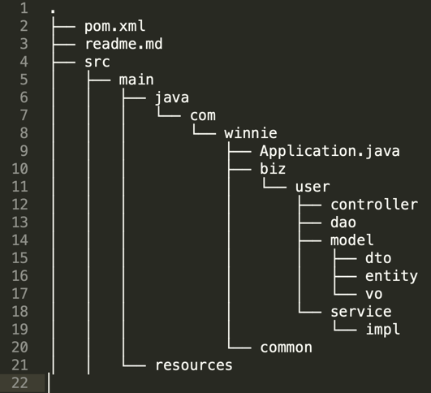

# 写在前面
如果有需要快速搭建javaweb应用，可以直接引入本项目作为技术栈

# 技术栈
- springboot: 2.0.1.RELEASE
- mybatis:2.0.0

# 特色
- 引入VO、DTO、DO等对象模型
- 使用Restful风格进行api编写

# 数据库
项目中使用的表为
T_USER

| id | username |
| --- | --- |
| 1 | yyq |
| 2 | yyq2 |

# 项目结构

- .src/main/java/com/winnie 代码路径
- .src/main/java/com/winnie/biz 业务目录（按业务拆包）
- .src/main/java/com/winnie/common 公共模块，如工具类等
- .src/main/resources 配置文件

# 如何使用本项目
1. 初始化数据库，例如数据库名称为testdb
2. 执行脚本reousrces/init.sql，自动建表
3. 修改resources/application.yml的数据库配置
4. 以debug模式启动服务，com.winnie.Application
5. 参考resources/unittest.txt手册，根据测试api进行代码走读